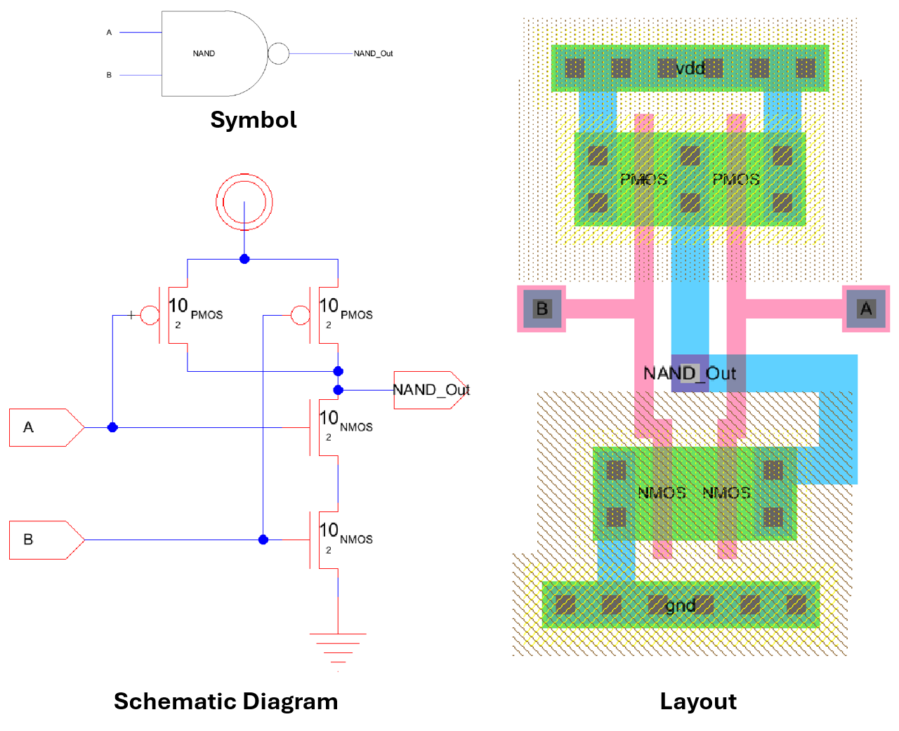
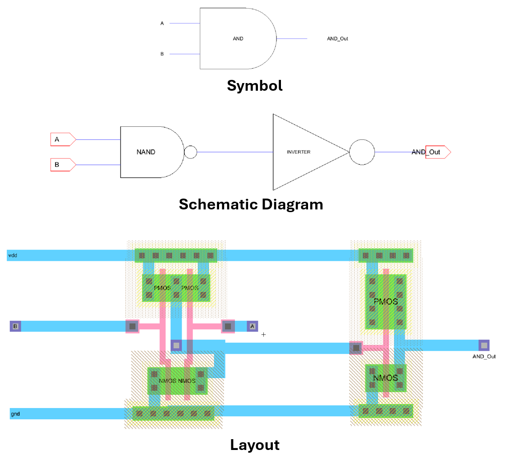
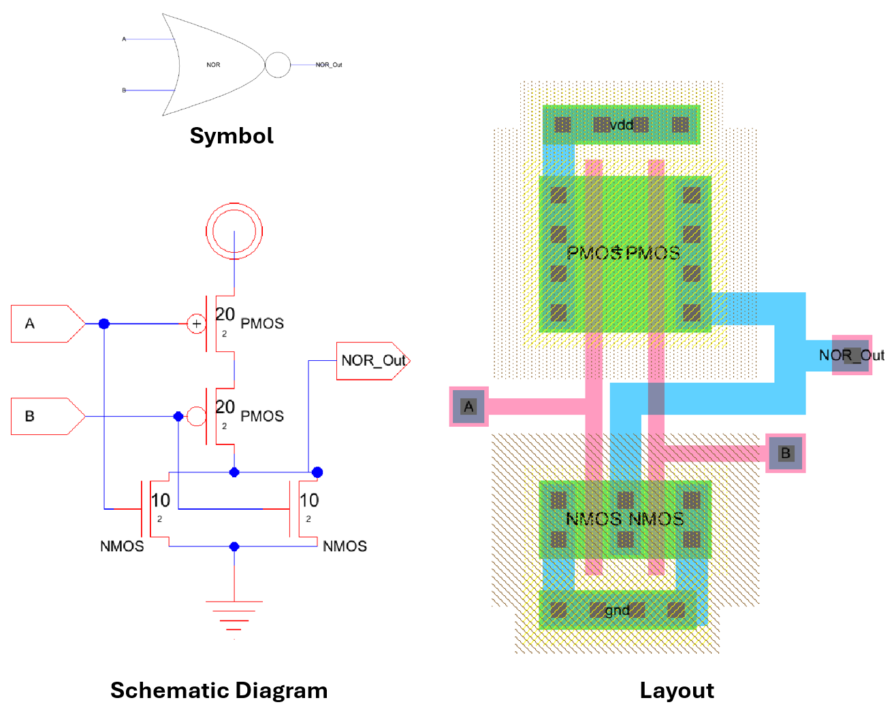
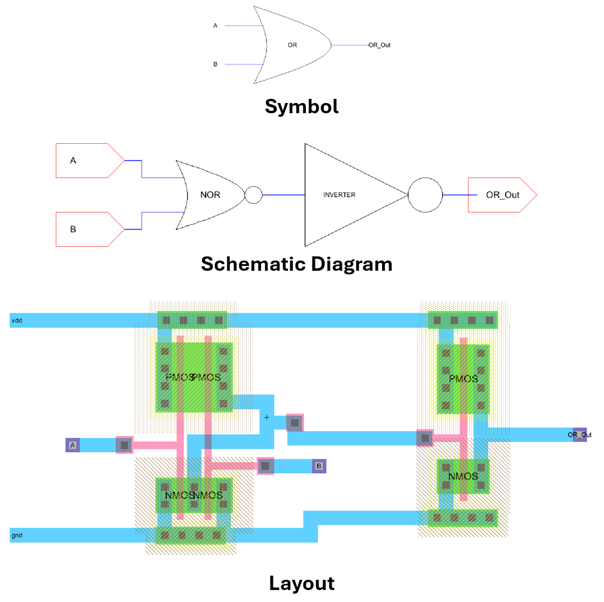
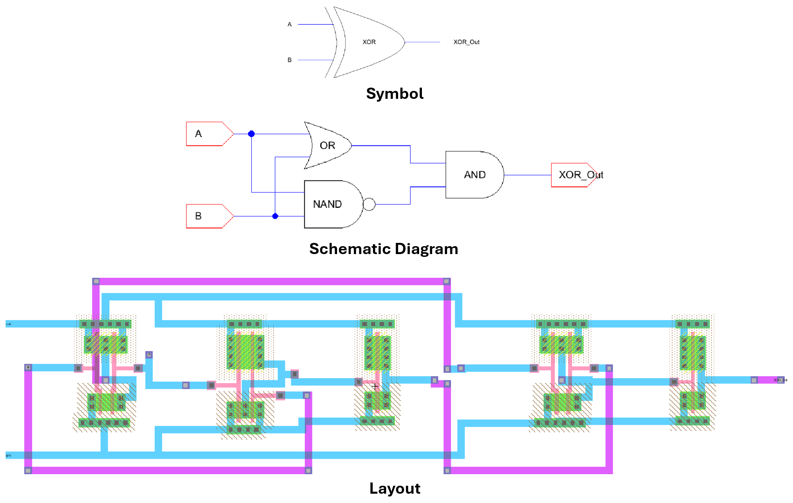
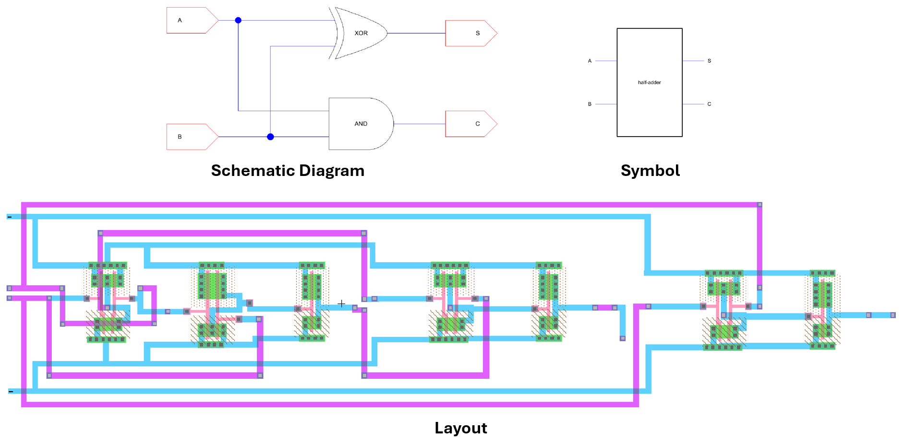

<h1 align="center">Digital CMOS IC Design and Simulation Using Electric VLSI Tool ⚡</h1>

## 📖 Overview

<div align="justify">

This repository presents the design, layout implementation, and simulation of fundamental CMOS digital integrated circuits using the Electric VLSI EDA Tool and LTspice. It serves as a practical learning resource for understanding CMOS logic design, VLSI layout development, SPICE simulation, and digital IC verification techniques. The project covers the complete workflow of CMOS digital circuit design, including schematic creation and stick/layout design to netlist extraction and transient waveform analysis.

</div>

## 🚀 Tools Used
<ul>
  <li><a href="https://staticfreesoft.com/productsFree.html">Electric VLSI EDA Tool (electricBinaryFull-9.08)</a></li>
  <li><a href="https://adoptium.net/temurin/releases/">Eclipse Temurin</a></li>
  <li><a href="https://www.analog.com/en/design-center/design-tools-and-calculators/ltspice-simulator.html">LTspice</a></li>
</ul>

## 🔧 CMOS Digital Circuit Projects
<ul>
  <li>CMOS Inverter</li>
  <li>NAND Gate</li>
  <li>AND Gate</li>
  <li>NOR Gate</li>
  <li>OR Gate</li>
  <li>XOR Gate</li>
  <li>Half Adder</li>
</ul>

<p>Each project may include:</p>
<ul>
  <li>Schematic designs</li>
  <li>IC layouts</li>
  <li>SPICE netlists</li>
  <li>Simulation files</li>
  <li>Waveform outputs</li>
</ul>

## 🔗 Circuit Layouts & Netlists

### **[CMOS NAND Gate](https://github.com/ejramirez525/Digital-Integrated-Circuit-Design/tree/main/nand)**

<div align="center">
  
  <p><em>Fig. 1 CMOS NAND gate schematic and layout</em></p>
</div>

* **Transient Analysis** <br>
    In LTspice, open the generated netlist (`nand-gate/nand.spi`) and plot the following traces: <br>
    * V(a) upper pane<br>
    * V(b) mid pane
    * V(NAND_Out) lower pane
  ```spice
    vdd vdd 0 dc 5
    va A 0 pulse(0 5 0 1n 1n 10n 20n)
    vb B 0 pulse(0 5 0 1n 1n 10n 20n)
    .tran 1n 100n
    .include "C:\C5_models.txt"
    ```

---

### **[CMOS AND Gate](https://github.com/ejramirez525/Digital-Integrated-Circuit-Design/tree/main/and)**

<div align="center">
  
  <p><em>Fig. 2 CMOS AND gate schematic and layout</em></p>
</div>

* **Transient Analysis** <br>
    In LTspice, open the generated netlist (`and-gate/and.spi`) and plot the following traces: <br>
    * V(a) upper pane<br>
    * V(b) mid pane
    * V(AND_Out) lower pane
  ```spice
    vdd vdd 0 dc 5
    va A 0 pulse(0 5 0 1n 1n 10n 20n)
    vb B 0 pulse(0 5 0 1n 1n 10n 40n)
    .tran 1n 100n
    .include "C:\C5_models.txt"
    ```
    ***Note:** Before running the SPICE simulation, all SPICE code in the CMOS inverter and CMOS NAND Gate schematic and layout should be `removed`.*

---

### **[NOR Gate](https://github.com/ejramirez525/Digital-Integrated-Circuit-Design/tree/main/nor)**

<div align="center">
  
  <p><em>Fig. 3 NOR gate schematic and layout</em></p>
</div>

* **Transient Analysis** <br>
    In LTspice, open the generated netlist (`nor-gate/nor.spi`) and plot the following traces: <br>
    * V(a) upper pane<br>
    * V(b) mid pane
    * V(NOR_Out) lower pane
  ```spice
    vdd vdd 0 dc 5
    va A 0 pulse(0 5 0 1n 1n 2u 4u)
    vb B 0 pulse(0 5 0 1n 1n 1u 2u)
    .tran 1n 10u
    .include "C:\C5_models.txt"
    ```

---

### **[OR Gate](https://github.com/ejramirez525/Digital-Integrated-Circuit-Design/tree/main/or)**

<div align="center">
  
  <p><em>Fig. 4 OR gate schematic and layout</em></p>
</div>

* **Transient Analysis** <br>
    In LTspice, open the generated netlist (`or-gate/or.spi`) and plot the following traces: <br>
    * V(a) upper pane<br>
    * V(b) mid pane
    * V(OR_Out) lower pane
  ```spice
    vdd vdd 0 dc 5
    va A 0 pulse(0 5 0 1n 1n 2u 4u)
    vb B 0 pulse(0 5 0 1n 1n 1u 2u)
    .tran 1n 10u
    .include "C:\C5_models.txt"
    ```
    ***Note:** Before running the SPICE simulation, all SPICE code in the CMOS inverter and NOR Gate schematic and layout should be `removed`.*

---

### **[XOR Gate](https://github.com/ejramirez525/Digital-Integrated-Circuit-Design/tree/main/xor)**

<div align="center">
  
  <p><em>Fig. 5 XOR gate schematic and layout</em></p>
</div>

* **Transient Analysis** <br>
    In LTspice, open the generated netlist (`xor-gate/xor.spi`) and plot the following traces: <br>
    * V(a) upper pane<br>
    * V(b) mid pane
    * V(XOR_Out) lower pane
  ```spice
    vdd vdd 0 dc 5
    va A 0 pulse(0 5 0 1n 1n 2u 4u)
    vb B 0 pulse(0 5 0 1n 1n 1u 2u)
    .tran 1n 10u
    .include "C:\C5_models.txt"
    ```
    ***Note:** Before running the SPICE simulation, all SPICE code in the OR, NAND, and AND Gates schematic and layout should be `removed`.*

---

### **[Half Adder](https://github.com/ejramirez525/Digital-Integrated-Circuit-Design/tree/main/half-adder)**

<div align="center">
  
  <p><em>Fig. 6 Half Adder schematic and layout</em></p>
</div>

* **Transient Analysis** <br>
    In LTspice, open the generated netlist (`half-adder/half-adder.spi`) and plot the following traces: <br>
    * V(a) upper pane<br>
    * V(b) mid pane
    * V(Sum) and V(Carry) lower panes
  ```spice
    vdd vdd 0 dc 5
    va A 0 pulse(0 5 0 1n 1n 2u 4u)
    vb B 0 pulse(0 5 0 1n 1n 1u 2u)
    .tran 1n 10u
    .include "C:\C5_models.txt"
    ```
    ***Note:** Before running the SPICE simulation, all SPICE code in the XOR and AND Gates schematic and layout should be `removed`.*